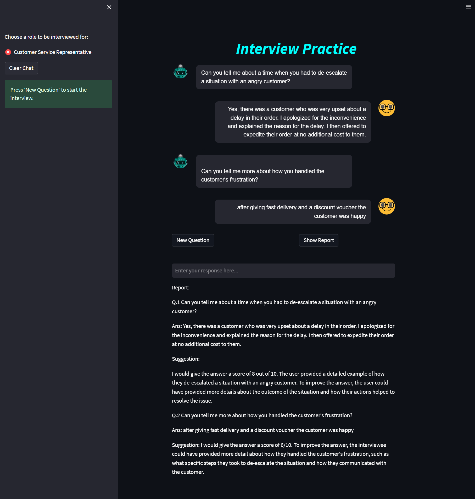

# Interview-Chatbot

## Revolutionizing the way we interview: AI-powered chatbot for efficient and engaging interviews

- The traditional process of conducting job interviews is time-consuming and requires significant effort from HR teams. Companies are searching for more efficient ways to conduct interviews while still providing a personalized experience for candidates. The solution to this problem is an AI-powered interview chatbot that can conduct interviews in a conversational manner while providing valuable insights to recruiters.

- The AI Interview Chatbot is a project that aims to develop an AI-powered chatbot to conduct job interviews. The chatbot will use ChatGPT to simulate a human conversation and ask candidates a set of pre-defined questions. The chatbot will then evaluate the candidates' responses and provide a comprehensive assessment and a score of their suitability for the role.

- The AI Interview Chatbot is designed to streamline the interview process for recruiters and provide a more efficient and engaging experience for candidates. The chatbot will enable recruiters to conduct interviews at scale while maintaining consistency and objectivity. Candidates will also benefit from the convenience of being able to complete the interview remotely at a time that suits them.

- The AI Interview Chatbot will be developed using cutting-edge technologies such as ChatGPT, Pinecone, LangChain, and Streamlit to ensure that it provides a seamless and user-friendly experience for both recruiters and candidates. The project will focus on developing a chatbot that is easy to use, accurate, and efficient in conducting interviews.

- Overall, the AI Interview Chatbot is a project that has the potential to revolutionize the way job interviews are conducted. It will provide a more efficient, scalable, and objective way of conducting interviews, and it will enable recruiters to focus their time and effort on more strategic tasks.



# Tools:

- VScode
- LangChain
- Pinecone
- Python
- Streamlit

# Large Language Model (LLM):

- text-davinci-003

# Getting Started
After cloning the repository to local machine.
To run the project locally, run the following CLI commands.
```
pip install -r requirements.txt ## Install all the dependencies
streamlit run main.py ## Run the main application
```

Your .env file should contain the following variables:
```
OPENAI_API_KEY=<YOUR API KEY>
PINECONE_API_KEY=<YOUR API KEY>
PINECONE_ENVIRONMENT_NAME=<YOUR ACCOUNTS REGION>
```

